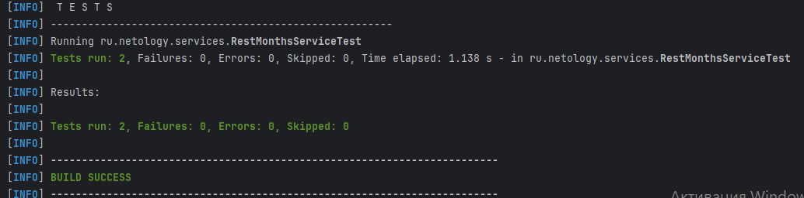

# Программа расчета количества месяцев отдыха в году
_Цель_: применить на практике **циклы** в Java; проверить корректность вычислений программы **параметризированными юнит-тестами** на Maven, JUnit5

# Входные данные

* два набора входных параметров: доход, ежемесячные расходы, минимальный баланс счета для отдыха в следующем месяце
* нулевой баланс счета на старте
* если баланс счета < минимально необходимого для отдыха, то получаем доход и оплачиваем ежемесячные расходы
* если баланс => минимально необходимого для отдыха, то оплачиваем ежемесячные расходы, а 2/3 оставшейся суммы тратим на отпуск
* _для первого набора параметров_ верный ответ: **3 месяца отдыха в течение года**
* _для второго набора параметров_ верный ответ: **2 месяца отдыха в течение года**

# Выходные данные

* проведено 2 теста, 0 ошибок
* успешная сборка

mvn clean test

